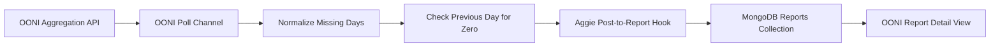

# Everything About the OONI Integration

## Purpose

This integration adds OONI `web_connectivity` measurement-volume monitoring to
Aggie for two Iranian mobile networks:

| Network | ASN |
| --- | --- |
| IranCell | AS44244 |
| MCCI | AS58224 |

The integration uses Aggie's existing source, polling, report, and MongoDB
infrastructure. It does not introduce a separate service or database.

## Requested Alert Rules

For each ASN, Aggie evaluates the OONI measurement volume once a day using only
completed UTC days.

For alert date `D`:

Aggie creates a `zero_measurements` alert when the total `measurement_count` on
`D-1` is zero. Nonzero measurement counts do not generate an alert.

These are measurement-volume alerts aggregated across all `web_connectivity`
tests for an ASN. They are not individual website-failure alerts.

## Daily Timing

The OONI channel polls hourly. It waits until 06:00 UTC before evaluating the
previous completed day. This delay gives OONI time to publish the previous day's
aggregates and reduces false zero-measurement alerts.

## Report Deduplication

The report GUID follows this format:

```text
ooni:<asn>:volume:<alert-date>
```

For example:

```text
ooni:44244:volume:2026-01-10
```

This deterministic GUID prevents duplicate reports when the hourly poll runs
again.

## Example Stored Report

```json
{
  "guid": "ooni:44244:volume:2026-01-10",
  "authoredAt": "2026-01-10T00:00:00.000Z",
  "author": "OONI AS44244",
  "content": "OONI volume alert for IranCell (AS44244): no web connectivity measurements were recorded on 2026-01-09.",
  "_media": ["OONI"],
  "metadata": {
    "rawAPIResponse": {
      "probeCC": "IR",
      "probeASN": 44244,
      "networkName": "IranCell",
      "testName": "web_connectivity",
      "alertDate": "2026-01-10",
      "triggers": [
        {
          "type": "zero_measurements",
          "alertDate": "2026-01-10",
          "measurementDay": "2026-01-09",
          "measurementCount": 0
        }
      ]
    }
  }
}
```

## Architecture



## Database Storage

OONI alerts use the same MongoDB `reports` collection as other Aggie reports.
They contain:

- Alert summary and timestamps.
- ASN and network name.
- Zero-measurement trigger details.
- OONI Explorer link.
- Aggie source and media identifiers.
- A deterministic deduplication GUID.

The OONI source and polling configuration use Aggie's existing `sources` and
`credentials` collections. OONI is public, so its credential record does not
contain an API token.

## Backend Files

### `backend/fetching/ooniApi.js`

Calls the public OONI aggregation API for daily measurement counts.

### `backend/fetching/ooniAlerts.js`

Contains dependency-free alert logic:

- Fills omitted calendar dates with zero measurements.
- Produces a zero-measurement trigger when the previous completed day is zero.

Keeping this logic separate allows the real-time channel and historical
backtest to use the same calculations.

### `backend/fetching/channels/ooni.js`

Implements the native Aggie `PollChannel`. It:

- Parses configured ASNs.
- Polls OONI hourly.
- Applies the 06:00 UTC publication delay.
- Fetches daily aggregate counts.
- Evaluates the previous completed day for zero measurements.
- Creates deterministic GUIDs.
- Enqueues reports through Aggie's normal fetching pipeline.

### `backend/fetching/sourceToChannel.js`

Creates an `OONIChannel` when Aggie loads a source with media type `ooni`.
The source's existing `lists` field stores space- or comma-separated ASNs.

### `backend/fetching/hooks/postToReport.js`

Converts OONI channel posts into standard Aggie reports and stores OONI data in
`metadata.rawAPIResponse`.

### `backend/models/source.js`

Adds `ooni` to the valid source media types.

### `backend/models/credentials.js`

Adds `ooni` as a valid credential type. The record exists to follow Aggie's
current source/credential relationship, but no secret is required.

## Frontend Files

### `src/pages/Settings/Credentials/CreateCredentialForm.tsx`

Adds a token-free OONI credential form.

### `src/pages/Settings/source/CreateEditSourceForm.tsx`

Adds the OONI source form. Its default ASN list is:

```text
44244 58224
```

### `src/api/common.ts`

Adds OONI to frontend media and credential options.

### `src/objectTypes.d.ts`

Adds `OONI` to the frontend media type declaration.

### `src/components/SocialMediaPost/SocialMediaIcon.tsx`

Displays a globe icon for OONI reports.

### `src/components/SocialMediaPost/OONIPost.tsx`

Renders the expanded OONI report view with:

- Network, ASN, and alert date.
- The zero-measurement trigger.
- A link to the corresponding OONI Explorer query.

### `src/components/SocialMediaPost/index.tsx`

Routes reports with media type `OONI` to `OONIPost`.

## Backtest and Tests

### `scripts/backtest-ooni-alerts.js`

Runs the same alert evaluator used by the production channel from December 1,
2025 through a specified end date.

Run it with:

```powershell
npm run backtest:ooni -- 2026-07-30
```

It writes:

```text
data/ooni-alert-backtest.json
data/ooni-alert-backtest.csv
```

The `data` directory is ignored by Git.

### `test/backend/lib.fetching.ooni-alerts.test.js`

Tests:

- Missing aggregation days becoming zero counts.
- Zero-measurement triggers.
- Nonzero completed days producing no alert.

### `package.json`

Adds the `backtest:ooni` command.

## Historical Results

Backtest period: December 1, 2025 through July 30, 2026.

The backtest emits only dates where the previous completed day has zero
measurements. Re-run the backtest to generate current zero-only totals.

## Aggie Configuration

1. Open Settings and then Credentials.
2. Create an `ooni` credential. No token is required.
3. Open Settings and then Sources.
4. Create an `ooni` source.
5. Select the OONI credential.
6. Keep or enter the ASN list `44244 58224`.
7. Enable the source.
8. Turn global fetching on.

After configuration, future zero-measurement days create reports automatically.

## Validation Completed

The following checks passed:

- JavaScript syntax checks for all OONI backend files.
- Editor diagnostics for modified JavaScript and TypeScript files.
- Synthetic zero-day and nonzero-day checks.
- Live OONI aggregation requests for both ASNs.
- Git whitespace validation.

A full npm build and full repository test run remain pending because this
machine's network policy currently rejects TLS connections to
`registry.npmjs.org`. The OONI API itself is reachable and the integration logic
has been validated against live data.

## Current Limitations

- There is no incident-level cooldown beyond one deterministic report per ASN
  and alert date.
- The production channel must be enabled in Aggie before polling begins.
- End-to-end runtime verification requires the repository dependencies to be
  installed.
